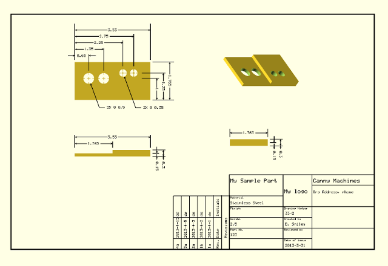
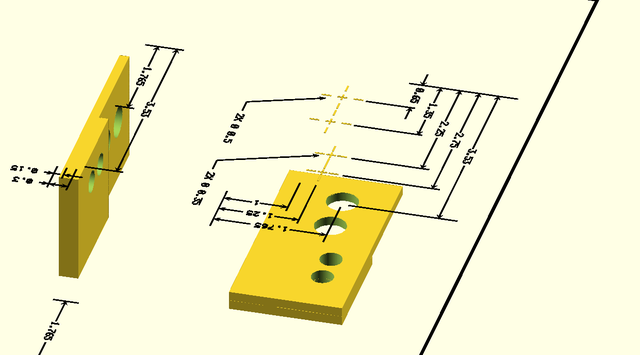
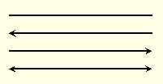
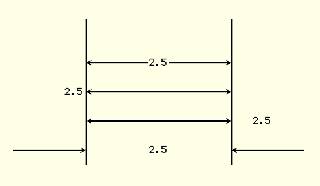
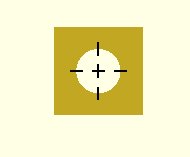
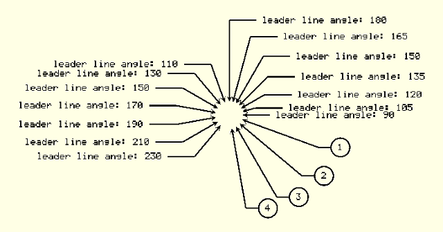
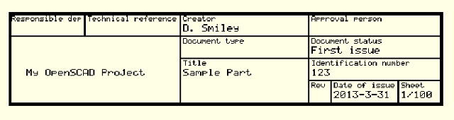
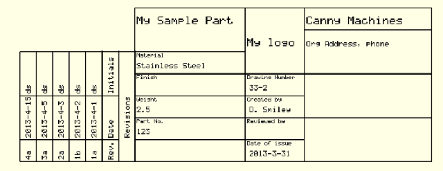

#### OpenSCAD Dimensioned Drawings

source: [Canny Machines](http://cannymachines.com/entries/9/openscad_dimensioned_drawings) --Don Smiley

**Disclaimer:** I am not the author of this library. All credit goes to Don Smiley. All I have done was take his library and website HTML and create a git repo and markdown file.



#### Dimensioned Drawings with OpenSCAD
OpenSCAD is an open-source program used to create 3D objects. Part of its appeal stems from the form of input to create the objects. Unlike some other 3d programs such as Blender, the means of input is essentially a written program that specifies the objects, placement, rotation and other features. By creating a small program, the object can come to life with full control of the characteristics of the object from a text level. That means less messy tweaking on the screen with the mouse and fudged dimensions.

However, suppose that you would like to go into the workshop and create your new creation with manual machining equipment? You quickly run into a problem: A lack of an annotated engineering drawing.

This program represents a first pass at enabling dimensioned drawings. While by no means complete, useful work can be performed with the modules included here.

#### General Approach
The approach uses a top view in OpenSCAD with all of the dimensioned lines and text on the xy plane. Combing multiple views of your object in various projections and translations with dimensioned lines overlayed on a plane just above your object will give the illusion of a dimensioned drawing.

The image below shows a portion of the previous image, still primarily a top view, but rotated to break the illusion of a flat drawing.



#### Dimensioning Elements Available
A number of elements must come together to implement dimensioning. There must be lines, some with arrows, and some without. Written annotations must accompany the lines to provide dimensions and other written descriptions. In addition, there are a number of conventions associated with annotations and a partial implementation of such functions are included.

#### Getting Started
Download the zip file [here](http://cannymachines.com/static/downloads/dimlines.zip)

The source for text generation is found at [http://www.thingiverse.com/thing:59817](http://www.thingiverse.com/thing:59817) , and I gratefully acknowledge user PGreenland on that site for creating this dotmatrix style font.

Download his file first, TextGenerator.scad, before attempting to run this program.

Using this file enabled the quick creation of the dimensioning modules found here. A later task associated with text would be the later creation of additional annotating symbols not found within this file. However, it enables a good start to many dimensioning functions.

To use dimlines, you must first include dimlines.scad.

#### Lines
This module draws a line that can have an arrow on either end. Because the intended use is to be viewed strictly from above, the height of the line is set arbitrarily thin.

 

The default orientation is a horizontal line along the x axis. Therefore, any other orientations would be handled with the usual rotation function.

```
// A sample used to create the image above.
line(length=2, width=DIM_LINE_WIDTH, height=DIM_HEIGHT,
    left_arrow=false, right_arrow=false);

translate([0, -0.25, 0])
line(length=2, width=DIM_LINE_WIDTH, height=DIM_HEIGHT, left_arrow=true,
    right_arrow=false);

translate([0, -0.5, 0])
line(length=2, width=DIM_LINE_WIDTH, height=DIM_HEIGHT,
    left_arrow=false, right_arrow=true);

translate([0, -0.75, 0])
line(length=2, width=DIM_LINE_WIDTH, height=DIM_HEIGHT, left_arrow=true,
    right_arrow=true);
```

There is also a module, arrow, which is used to create the arrow, but it is unlikely you would use it isolation.

One choice made for primitives in OpenSCAD involves the selection of `center=true` or `center=false`. A line is treated somewhat differently here. A line length is treated as `center=false`. This enables a intuitive positioning of lines for dimensioning, leader lines, etc. However, the width of the line is centered `(center=true)` to avoid wasting time translating the line by a half-line width when drawing the bounding lines for dimension lines.

#### Dimensions
Dimensioning entails in large part drawing lines with arrows enclosing a dimension.



The following shows the options available with dimensioned lines. Two lines are drawn vertically to illustrate the limits that the dimensioned lines are designed to describe. The constants `DIM_CENTER`, `DIM_LEFT`, `DIM_RIGHT`, and `DIM_OUTSIDE` are used to modify the placement of text. Normally, you would use `DIM_CENTER`, to put the dimension inside the lines. However, if there is not enough room, `DIM_LEFT` and `DIM_RIGHT` can be used to place the text on either side. Finally, `DIM_OUTSIDE` is used when the arrows are pointing inward to a space.

```
/* shows all possibilities
        DIM_CENTER = 0;
        DIM_LEFT = 1;
        DIM_RIGHT = 2;
        DIM_OUTSIDE = 3;
*/

length = 2.5;

// The following two lines are vertical lines that bracket the dimensions
// left arrow
translate([0, -1.75, 0])
rotate([0, 0, 90])
line(length=length, width=DIM_LINE_WIDTH, height=DIM_HEIGHT,
     left_arrow=false, right_arrow=false);

// right arrow
translate([length, -1.75, 0])
rotate([0, 0, 90])
line(length=length, width=DIM_LINE_WIDTH, height=DIM_HEIGHT,
     left_arrow=false, right_arrow=false);

//  The following runs through all the dimension types
for (i = [0:4]) {
    translate([0, -.5 * i, 0])
    dimensions(length=length, line_width=DIM_LINE_WIDTH, loc=i);
}
```

For thoroughness, all of the options are shown explicitly. However, the default values for the module are designed to minimize settings that you have no interest in changing:

```
line(length=mylength);                  // line without arrows
line(length=mylength, left_arrow=true); // line with left arrow
```

#### Hole Center Cross
This module creates a cross in the center of hole. It also draws the guides that intersect the radius.



```
radius = .25;
difference() {
    cube([1, 1, 1], center=true);
    cylinder(h=1.1, r=radius, center=true, $fn=100);
}

color(BLACK)
translate([0, 0, .51])
circle_center(radius=radius, size=DIM_HOLE_CENTER,
    line_width=DIM_LINE_WIDTH);
```

The dimension lines that partially extend over an object will be set by you as according to your taste. I have viewed documentation where a line to hole extends clear across an object, or just extends slightly over its edge. So, this function will does not attempt to handle any of that. That can be done via appropriate use of the line module.

#### Leader Lines
Leader lines serve multiple purposes. For example, pointing directly at the center of a circle with the arrow resting against the radius, provides the dimensions of a hole or shaft when viewed on end.

Another use of a leader line arises when pointing out the name of an object when showing an assembly of parts.



A leader line in the program has several elements. There is a line with an arrow that is typically at an angle. That line is then met by a horizontal line extending to either the right or left. Text on the end, signifies either dimensions or a number indexed to a table in the title block for the part being referenced.

```
leader_line(angle, radius, angle_length, horz_line_length,
            direction=DIM_RIGHT, line_width, text, do_circle=false)
```

You would typically use this module after translating to the center of your hole or circle object, or item that you want to describe. If you are dimensioning a circle, then you would use the radius value to offset the arrow to the rim of the circle. In the case of a leader line to an object, you would set the radius to zero. The angle_length is the length of the arrow extending away at your chosen angle. The `horz_line_length` is the length once it bends to a horizontal line. The direction sets your preference for the horizontal line to extend to the right or left `(DIM_LEFT or DIM_RIGHT)`. The line_width is used if you wish to modify the weight of this particular leader line. *(In most cases, you would simply use the default value, DIM_LINE_WIDTH).* Then, you would pass through the text that corresponds to your dimensions or object number. Finally, if `do_circle` is `true`, a circle will be drawn around the text.

The following shows a varied use of the parameters, and generated the `leader_line` image shown above.

```
radius = .25;
for (i = [0:6]) {
    leader_line(angle=i * 15, radius=.25, angle_length=(i * .25),
                horz_line_length=.5, direction=DIM_RIGHT,
                line_width=DIM_LINE_WIDTH,
                text=str("leader line angle: ", i * 15 + 90),
                do_circle=false
               );
}

for (i = [1:7]) {
    leader_line(angle=i * 20 + 90, radius=.25,
                angle_length=.75,
                horz_line_length=.5, direction=DIM_LEFT,
                line_width=DIM_LINE_WIDTH,
                text=str("leader line angle: ", i * 20 + 90));
}
for (i = [1:4]) {
    leader_line(angle=-i * 20, radius=.25, angle_length=1.5,
                horz_line_length=.25, direction=DIM_RIGHT,
                line_width=DIM_LINE_WIDTH,
                text=str(i),
                do_circle=true
               );
}
```

#### Title Blocks
To account for the variety of title blocks found on drawings, the module for creating title blocks builds the blocks from a series of arrays passed into the module that comprise a definition of the type and placement of lines, title descriptions, and text describing the object at hand. With these three elements a wide variety of title blocks can be made.

The full version of sample title block can be found on the `dimlines.scad` file under the module, **sample_titleblock1**.

To circle the problem first, here is how the module eventually is called:

```
titleblock(lines, descs, details);
```

The idea is that the messy details for all the lines, text, etc are embodied in the arrays, yet calling the module is fairly clean.

In the next few sections an example of a title block will be created. The actual format of this title block is somewhat like the example presented in [Wikipedia](http://en.wikipedia.org/wiki/Engineering_drawing#Title_block) as an example of a title block.

#### Title Block Lines
The lines array is structured in the following fashion:

```
lines     = [[startx, starty, horz/vert, length, width],
             [startx, starty, horz/vert, length, width]]
```

`startx` and `starty` represent the `x`, `y` coordinates where the line will start. `horz/vert` is the variable that specifies whether the line is vertical or horizontal. Your choices are the constants `DIM_VERT` or `DIM_HORZ`. `length` of course is the length of the line. `width` might be slightly ambiguous. It is not the actual width of the line. Rather, it is a factor that represents the thickness of the line relevant to the standard thickness that you have chosen for your lines. So, `width` would normally be `1` unless you want the line thicker or thinner than your other lines.

```
title_width = 290;
row_height = 15;

cols = [-1, 50, 114, 200, 215, 260];
rows = [0, -row_height, -row_height * 2, -row_height * 3, -row_height * 4];

// spacing tweaks to fit into the blocks
desc_x = 2; // column offset for start of small text
desc_y = -5; // row offset for start of small text
det_y = -12;  // row offset for start of detail text
desc_size = .75; // relative size of description text

lines = [
    // horizontal lines
    [cols[0], rows[0], DIM_HORZ, title_width, 2],
    [cols[0], rows[1], DIM_HORZ, title_width, 1],
    [cols[2], rows[2], DIM_HORZ, title_width - cols[2] - 1, 1],
    [cols[3], rows[3], DIM_HORZ, title_width - cols[3] - 1, 1],
    [cols[0], rows[4] - 1, DIM_HORZ, title_width, 2],

    // vertical lines
    [0, 0, DIM_VERT, row_height * 4, 2],
    [cols[1], rows[0], DIM_VERT, row_height, 1],
    [cols[2], rows[0], DIM_VERT, row_height * 4, 1],
    [cols[3], rows[0], DIM_VERT, row_height * 4, 1],
    [cols[4], rows[3], DIM_VERT, row_height, 1],
    [cols[5], rows[3], DIM_VERT, row_height, 1],
    [title_width - 1, 0, DIM_VERT, row_height * 4, 2],
];
```

This code example shows the format of the lines. As you can see, the coordinates and lengths are fairly straight-forward. One aspect that might be confusing is the use of -1 for a starting x position rather that 0 on the horizontal lines. This value is chosen to adjust the line spacing associated with the line thickness of 2 versus 1. My usual approach involves starting with something that seems reasonable, and then adjusting/saving with automatic/reload until it finally appears to be correct.

#### Title Block Descriptions and Details
```
descs    = [[startx, starty, horz/vert, text, size],
            [startx, starty, horz/vert, text, size]]

details    = [[startx, starty, horz/vert, text, size],
             [startx, starty, horz/vert, text, size]]
```

The `descs` and `details` arrays hold the coordinates of the textual descriptions of the `title block`. The structure of these arrays mimics that of the `lines` array with exception of text and the substitution of the term width for size. Like `width`, `size` is a factor centered around `1` that scales the size of the text up or down.

```
descs = [
  [cols[0] + desc_x, rows[0] + desc_y, DIM_HORZ, "Responsible dep", desc_size],
  [cols[1] + desc_x, rows[0] + desc_y, DIM_HORZ, "Technical reference", desc_size],
  [cols[2] + desc_x, rows[0] + desc_y, DIM_HORZ, "Creator", desc_size],
  [cols[3] + desc_x, rows[0] + desc_y, DIM_HORZ, "Approval person", desc_size],
  [cols[2] + desc_x, rows[1] + desc_y, DIM_HORZ, "Document type", desc_size],
  [cols[3] + desc_x, rows[1] + desc_y, DIM_HORZ, "Document status", desc_size],
  [cols[2] + desc_x, rows[2] + desc_y, DIM_HORZ, "Title", desc_size],
  [cols[3] + desc_x, rows[2] + desc_y, DIM_HORZ, "Identification number", desc_size],
  [cols[3] + desc_x, rows[3] + desc_y, DIM_HORZ, "Rev", desc_size],
  [cols[4] + desc_x, rows[3] + desc_y, DIM_HORZ, "Date of issue", desc_size],
  [cols[5] + desc_x, rows[3] + desc_y, DIM_HORZ, "Sheet", desc_size]
];


details = [
  [cols[0] + desc_x, rows[0] + det_y, DIM_HORZ, " ", 1],   //Responsible dep.
  [cols[1] + desc_x, rows[0] + det_y, DIM_HORZ, " ", 1],   //Technical reference
  [cols[2] + desc_x, rows[0] + det_y, DIM_HORZ, "D. Smiley", 1], //Creator
  [cols[3] + desc_x, rows[0] + det_y, DIM_HORZ, " ", 1],   //Approval person
  [cols[0] + desc_x + 10, rows[2] + det_y, DIM_HORZ, "My OpenSCAD Project", 1],
  [cols[2] + desc_x, rows[1] + det_y, DIM_HORZ, " ", 1],   //Document type
  [cols[3] + desc_x, rows[1] + det_y, DIM_HORZ, "First issue", 1], //Document status
  [cols[2] + desc_x, rows[2] + det_y, DIM_HORZ, "Sample Part", 1], //Title
  [cols[3] + desc_x, rows[2] + det_y, DIM_HORZ, "123", 1], //Identification number
  [cols[3] + desc_x, rows[3] + det_y, DIM_HORZ, " ", 1],  //Rev
  [cols[4] + desc_x, rows[3] + det_y, DIM_HORZ, "2013-3-31", 1], //Date of issue
  [cols[5] + desc_x, rows[3] + det_y, DIM_HORZ, "1/100", 1]  //Sheet
];
```

With the arrays built, simply call the module with:

```
titleblock(lines, descs, details);
```

and you will get:



#### Another Sample Title Block
Now that you have seen on example of a title block, it might be helpful to see a slightly more complicated version of one. Like many things, the complexity can be reduced by breaking up components until small bite-sized chunks.

The full version of sample title block can be found on the **dimlines.scad** file under the module, `sample_titleblock2`.

The following image portrays our completed title block, which might help you to understand the pieces as we go.



We will create the title block in two chunks, the main title block and the revisions title block. Then, we will position them to into a cohesive whole.

Like our first example, we want to end our sample with calling the titleblock module with our three arrays. The only difference is the additional complexity of those arrays.

Here is the definition of the lines array with some initial constants. In this case, there are separate constants for the revisions section.

Note also the adjustment for the thickness of the line in the starting columns, -.5. By using separate constants for each kind of section, you adjust one section while minimizing change on a different area of the title block.

```
row_height = 20;

cols = [-.5, 100, 154, 270];
title_width = cols[3];

rows = [0, -row_height, -row_height * 2, -row_height * 3, -row_height * 4,
        -row_height * 5, -row_height * 6, -row_height * 7
];

// spacing tweaks to fit into the blocks
desc_x = 2; // column offset for start of small text
desc_y = -5; // row offset for start of small text
det_x = 15;  // col offset for start of detail text
det_y = -15;  // row offset for start of detail text
desc_size = .75; // relative size of description text


lines = [
    // horizontal lines
    [-.5, 0, DIM_HORZ, title_width, 1],

    [cols[2], rows[1], DIM_HORZ, cols[3] - cols[2] - .5, 1],
    [cols[0], rows[2], DIM_HORZ, cols[1] - cols[0] - .5, 1],
    [cols[0], rows[3], DIM_HORZ, cols[3] - .5, 1],
    [cols[0], rows[4], DIM_HORZ, cols[2] - .5, 1],
    [cols[0], rows[5], DIM_HORZ, cols[3] - .5, 1],
    [cols[0], rows[6], DIM_HORZ, cols[2] - .5, 1],
    [cols[0], rows[7], DIM_HORZ, cols[2] - .5, 1],

    [cols[0], rows[7], DIM_HORZ, title_width, 1],

    // vertical lines
    [cols[0], rows[0], DIM_VERT, -rows[7], 1],
    [cols[1], rows[0], DIM_VERT, -rows[7], 1],
    [cols[2], rows[0], DIM_VERT, -rows[7], 1],
    [cols[3], rows[0], DIM_VERT, -rows[7], 1],
];
```
#### Breaking up the Textual Descriptions
Separating the textual descriptions by category simplifies building the title block. Separate arrays are built for each category. Separating these arrays suggests that a separate file with for the org_details array could be stored and included so that you would only have to do that once.

```
part_desc = ["Material", "Finish", "Weight", "Part No."];
doc_desc = ["Drawing Number",
                "Created by",
                "Reviewed by",
                "Date of issue"
];

// aspects of the part
part_details = [
    "My Sample Part",   // title
    "Stainless Steel",  // material
    " ",                // finish
    "2.5",              // weight
    "123",              // part no
];

// aspects documenting the creation of the part
doc_details = [
    "33-2",             // Drawing No.
    "D. Smiley",        // Created by
    " ",                // Reviewed by
    "2013-3-31",        // Date
];

// the organization making the part
org_details = [
    "My logo",
    "Canny Machines",
    "Org Address, phone"
];
```

Next comes the task of combining our descriptions with location information.

```
descs = [

    // part description
    [cols[0] + desc_x, rows[2] + desc_y, DIM_HORZ, part_desc[0], desc_size],
    [cols[0] + desc_x, rows[3] + desc_y, DIM_HORZ, part_desc[1], desc_size],
    [cols[0] + desc_x, rows[4] + desc_y, DIM_HORZ, part_desc[2], desc_size],
    [cols[0] + desc_x, rows[5] + desc_y, DIM_HORZ, part_desc[3], desc_size],

    // documentation description
    [cols[1] + desc_x, rows[3] + desc_y, DIM_HORZ, doc_desc[0], desc_size],
    [cols[1] + desc_x, rows[4] + desc_y, DIM_HORZ, doc_desc[1], desc_size],
    [cols[1] + desc_x, rows[5] + desc_y, DIM_HORZ, doc_desc[2], desc_size],
    [cols[1] + desc_x, rows[6] + desc_y, DIM_HORZ, doc_desc[3], desc_size],
];

details = [
    [cols[0] + desc_x, rows[0] + det_y, DIM_HORZ, part_details[0], 1.5],
    [cols[0] + desc_x, rows[2] + det_y, DIM_HORZ, part_details[1], 1],
    [cols[0] + desc_x, rows[3] + det_y, DIM_HORZ, part_details[2], 1],
    [cols[0] + desc_x, rows[4] + det_y, DIM_HORZ, part_details[3], 1],
    [cols[0] + desc_x, rows[5] + det_y, DIM_HORZ, part_details[4], 1],

    [cols[1] + desc_x * 2, rows[3] + det_y, DIM_HORZ, doc_details[0], 1],
    [cols[1] + desc_x * 2, rows[4] + det_y, DIM_HORZ, doc_details[1], 1],
    [cols[1] + desc_x * 2, rows[5] + det_y, DIM_HORZ, doc_details[2], 1],
    [cols[1] + desc_x * 2, rows[6] + det_y, DIM_HORZ, doc_details[3], 1],

    // Organization Details
    [cols[1] + desc_x, rows[1] + det_y, DIM_HORZ, org_details[0], 1.5],
    [cols[2] + desc_x, rows[0] + det_y, DIM_HORZ, org_details[1], 1.5],
    [cols[2] + desc_x, rows[1] + det_y, DIM_HORZ, org_details[2], 1],
];

titleblock(lines, descs, details);
```

Finally, the last line calls the `titleblock` module. In our previous example, we were done at this point. However, we still have not created the `revisions block` that shows on the left of the `title block`. For this we will create a separate module and translate the `revisions block` to the appropriate position.

For purposes of this example, we will assume that we want the `revision block` to show only revisions; not show empty lines. It is easy either way; this way will be a little cleaner.

```
// sample revisions under some sort of revision numbering scheme
revisions = [
    ["1a", "2013-4-1", "ds"],
    ["1b", "2013-4-2", "ds"],
    ["2a", "2013-4-3", "ds"],
    ["3a", "2013-4-5", "ds"],
    ["4a", "2013-4-15", "ds"],
];
```

Now we will create a `revision module` that will then mesh with `main title block`.

The full version of sample `revision block` can be found on the **dimlines.scad** file under the module, `sample_revisionblock`.

In this case, we will start off in a similar fashion for the lines and descriptive text. However, we will use it to only create the heading portion of the `title block`.

```
// to start off the module, we pass in the revisions that will be used
module sample_revisionblock(revisions) {

    // revision block headings
    row_height = 15;
    revision_width = 100;
    desc_x = 2;
    desc_y = -10;
    desc_size = 1;

    cols = [0, 20, 60, revision_width];
    rows = [0, -row_height, -row_height * 2];

    // draw lines
    lines = [
        // horizontal lines
        [cols[0], rows[0], DIM_HORZ, revision_width, 1],
        [cols[0], rows[1], DIM_HORZ, revision_width, 1],
        [cols[0], rows[2], DIM_HORZ, revision_width, 1],

        // vertical lines
        [cols[0], rows[0], DIM_VERT, row_height * 2, 1],
        [cols[1], rows[0], DIM_VERT, row_height, 1],
        [cols[2], rows[0], DIM_VERT, row_height, 1],
        [cols[3], rows[0], DIM_VERT, row_height * 2, 1],
    ];

    descs = [
        [cols[0] + desc_x, rows[0] + desc_y, DIM_HORZ, "Rev.", desc_size],
        [cols[1] + desc_x, rows[0] + desc_y, DIM_HORZ, "Date", desc_size],
        [cols[2] + desc_x, rows[0] + desc_y, DIM_HORZ, "Initials", desc_size], 
        [cols[1] + desc_x, rows[1] + desc_y, DIM_HORZ, "Revisions", desc_size], ];

    details = [];
    num_revisions = len(revisions);
```

Down to here, this approach is very similar to any other title block. However, the details array is empty so far. In fact, what we will do is create a small title block with the heading descriptions for revisions, but we will manually draw the lines and the text for our revisions in place of building the complete block due to the difficulty in building variable length arrays on the fly.

In this next section, we first translate our position to a location consistent with our calling sample title block. Then, we execute a title block with the revisions heading material.

```
    translate([-(revision_width + 40) * DIM_LINE_WIDTH,
              row_height * 2 * DIM_LINE_WIDTH, 0])
    union() {
        titleblock(lines, descs, details);

    :::c

        //  now for the start of actual revisions
        //  do this piecemeal -- draw the vertical first

        for (col = [0: len(cols)]) {
            translate([cols[col] * DIM_LINE_WIDTH, 0, 0])
            rotate([0, 0, 90])
            line(num_revisions * row_height * DIM_LINE_WIDTH);
        }

        // now for each revision draw the line over it, then draw
        // the draw the revision text
        for (row = [0: len(revisions)]) {
            translate([0, row * row_height * DIM_LINE_WIDTH, 0])
            line(revision_width * DIM_LINE_WIDTH);

            for (col = [0:2]) {
                translate([(cols[col] + desc_x) * DIM_LINE_WIDTH,
                    ((row + 1) * row_height + desc_y) * DIM_LINE_WIDTH, 0])
                scale([DIM_FONTSCALE, DIM_FONTSCALE, DIM_FONTSCALE])
                drawtext(revisions[row][col]);
            }
        }

    }
}
```

At this point revision module has completed its work. The only left to do to finish is go back to the sample block module:

```
rotate([0, 0, 90])
sample_revisionblock(revisions);
```

At this point, you will have your revision block, on its side next to the calling titleblock. Note, that the revision title block could have been built on its side initially. To me it seems easier to look at the text without tipping my head, since OpenSCAD is so good at simply rotating anything.

#### Scaling Dimensions to Match the Objects
As discussed in the very beginning, sizing the dimensional components to match the relative size of your object will be important.

One way to do this is:

```
DOC_SCALING_FACTOR = 100;

include <dimlines.scad>

DIM_LINE_WIDTH = .025 * DOC_SCALING_FACTOR;
DIM_SPACE = .1 * DOC_SCALING_FACTOR;
```

Note that the `DOC_SCALING_FACTOR` constant is put on a line above the `include` statement. This placement is required due to the nature of assignment of constants within OpenSCAD.

By doubling the constants, any line will be twice as wide as before. Note the lengths of lines are unaffected. Those values are explicitly set.

#### Suggested Approach to Documentation
The modules have been designed to flexibly handle a variety of conditions. The following are some suggestions that can ease the burden of consistency within a mass of parts.

The OpenSCAD approach to constants or variables can be confusing at first. However, you can use that approach with variables to your advantage by organizing your constants in a hierarchical fashion.

>
* Maintain a separate file for each part
* Explicitly list dimensions as constants outside of your modules
* Use a consistent naming strategy in your project for constants
* Ensure that each constant is unique unless you are deliberately changing it

The primary issue revolves around handling constant values associated with a particular versus values common to a number of part.

For example, Suppose you create a part, `Part1`, made up of some specific dimensions. There are probably at least two activities associated with documenting the part. You will need a sheet that shows the dimensions of the part in various orientations. Also, on a separate sheet, you will want to show how that part fits with other parts in an assembly.

One way to do this would be to have one file with every part and set variables `true` or `false` to show documentation or not, or to include other parts or not. However, that gets unwieldy pretty fast.

If you have a separate file for each part, you can more easily mix and match your parts to adapt to the problem at hand.

contents of **assembly1.scad**

```
/* constants common to both parts
* They need to have a common hole radius, and since they fit together. Also,
* since they lock together via a slot on one part and projection on the 
* other, the slot width is also placed here.
*
* As an aside, if the part radius must be the same so that this assembly
* fits into something else, perhaps that part radius should be moved to that
* assembly file.
*/

PART_RADIUS = 20;
HOLE_RADIUS = 5;
SLOT_WIDTH = 3;
contents of file: part1.scad

// constants specific to part1
PART_HEIGHT = 10;
SLOT_DEPTH = 5;

module part1() {

    difference() {
        rotate([90, 0, 0])
        cylinder(h=PART_HEIGHT, r=PART_RADIUS, center=true, $fn=100);
        rotate([90, 0, 0])
        cylinder(h=PART_HEIGHT + 1, r=HOLE_RADIUS, center=true, $fn=100);

        translate([0, HOLE_RADIUS / 2, 0])
        cube([SLOT_WIDTH, SLOT_DEPTH + 2, PART_RADIUS * 2 + 1],
        center=true);
    }
}
```

contents of file: **part2.scad**

```
PART_HEIGHT = 1;
PART_RADIUS = 20;
SHAFT_RADIUS = 5;
SHAFT_HEIGHT = 55;

SLOT_WIDTH = 3;
SLOT_HEIGHT = 5;


module mypart4() {

    union() {
        rotate([90, 0, 0])
        cylinder(h=PART_HEIGHT, r=PART_RADIUS, center=true, $fn=100);
        rotate([90, 0, 0])
        cylinder(h=SHAFT_HEIGHT, r=SHAFT_RADIUS, center=true, $fn=100);

        translate([0, -PART_HEIGHT, 0])
        cube([SLOT_WIDTH, SLOT_HEIGHT, PART_RADIUS * 2 + 1], center=true);
    }
}
```

contents of file: **assembly1_doc.scad**

```
DOC_SCALING_FACTOR = 10;  
DOC_HEIGHT = 25;

include <dimlines.scad>

include <sample_part4.scad>
include <sample_part3.scad>


DIM_LINE_WIDTH = .025 * factor;
DIM_SPACE = .1 * factor;

...   the rest of file where the document is generated ...
```

By maintaining a clear separation between the constants used and the coding that creates the parts, when a dimension is changed, the change will ripple through any parts that share that dimension and the dimensioning documentation as well.

Also, while a minor point, suppose you have a large number of parts that you are maintaining with your system and a dimension changed. You could easily see which parts are affected by grepping the dimension constant to see which part shares that dimension.

Finally, in a larger system, you could maintain a hierarchical tree structure:

```
/organization layer/
|  
|-- logos  
|-- title block formats  
|-- common parts library
|
|-- product layer
      |
      |-- product 1
            |
            |-- assembly layer
                  |
                  |-- common constants
                  |
                  |-- assembly1
                        |-- part1
                        |     |
                        |     |-- part doc
                        |-- part2
                        |     |
                        |     |-- part doc
                        |
                        |-- assembly1 doc
```

By doing a little organizing up front, you would get a lot of consistency with less on-going effort.

#### Future Directions
There are a number of symbols that would be helpful to include in the documentation. This might involve modifying text generating file or exploring a swap from some other source.

Scaling remains an issue because there is not an effective method for generating an image that would be exactly a certain size. If there was a function for specifying a viewport that would help. Also, you would need more control over specifying the expected pixels per inch on your output.
